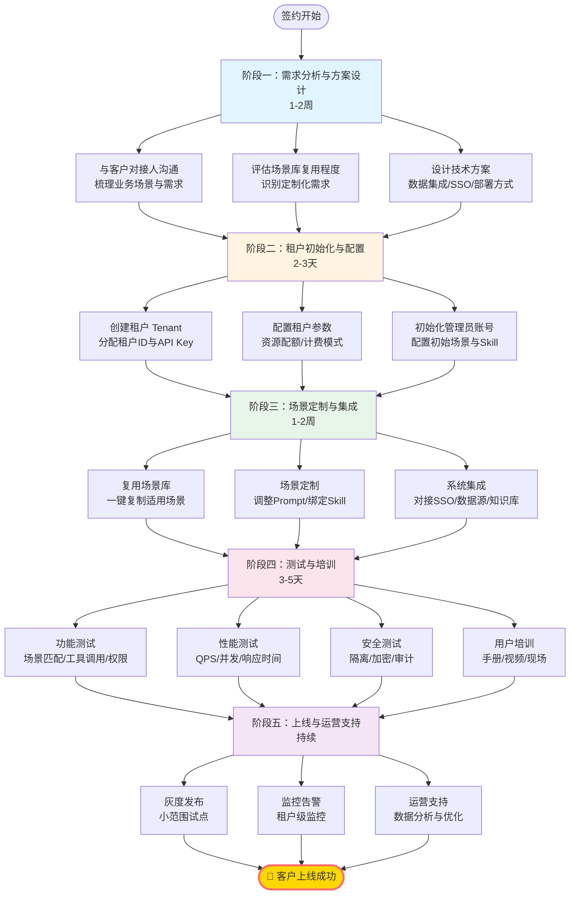
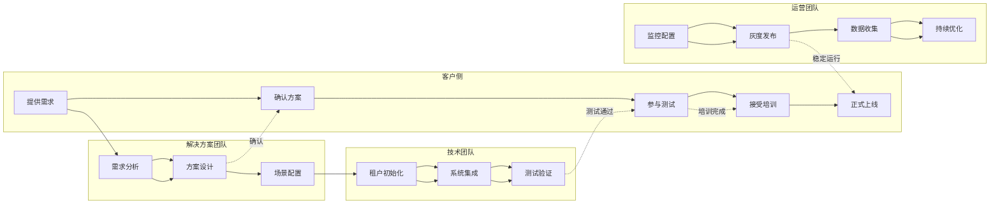

# 企业客户接入流程可视化

## 垂直流程图（步骤视角）

## 方案四：泳道图（角色协作视角）

## 关键交付物清单

| 阶段 | 交付物 | 责任人 | 验收标准 |
|------|--------|--------|----------|
| 阶段一 | 需求文档、技术方案 | 解决方案架构师 | 客户签字确认 |
| 阶段二 | 租户账号、配置清单 | 技术团队 | 账号可登录、配置生效 |
| 阶段三 | 定制场景、集成报告 | 技术+产品团队 | 场景测试通过、集成完成 |
| 阶段四 | 测试报告、培训材料 | 测试+运营团队 | 功能正常、用户会使用 |
| 阶段五 | 上线报告、监控看板 | 运营团队 | 系统稳定运行、告警正常 |

## 风险提示

⚠️ **关键风险点**：
1. **阶段一**：需求不明确 → 需多次沟通，可能延期 3-5 天
2. **阶段三**：定制化过重 → 控制定制比例 <30%，否则延期 1-2 周
3. **阶段四**：测试不通过 → 预留 2-3 天缓冲时间
4. **阶段五**：数据迁移 → 需提前 1 周准备，可能延期 3-7 天

## 加速策略

💡 **快速交付建议**：
1. **复用优先**：从公共场景库挑选，复用率目标 ≥60%
2. **并行推进**：阶段三和阶段四部分并行（如边开发边测试）
3. **模板化**：使用场景配置模板、Onboarding Checklist
4. **专家支持**：配备专属解决方案工程师，全程跟进
